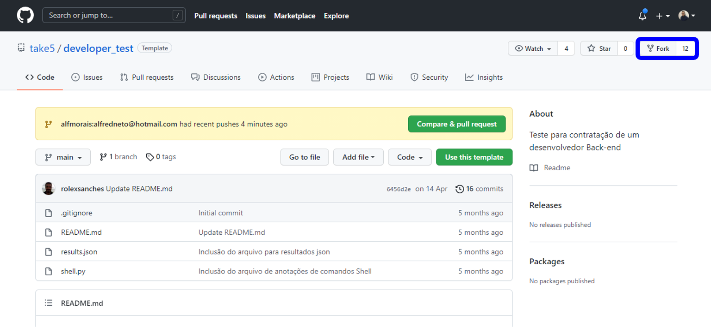
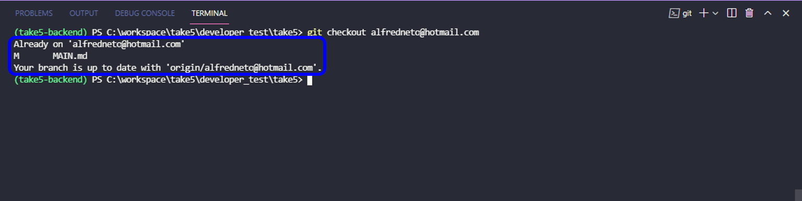
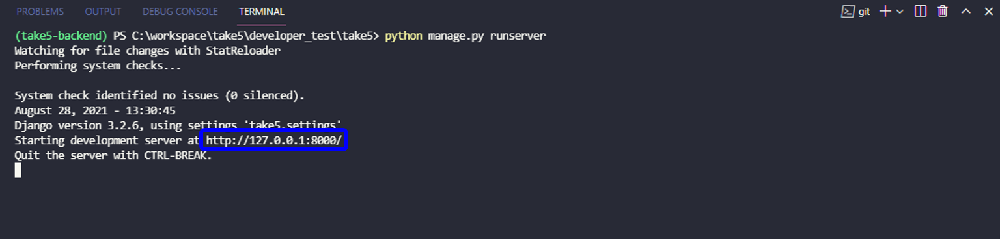
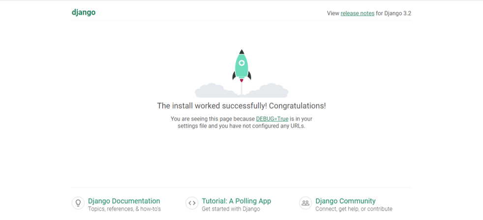

# Take5 - Contratação Desenvolvedor Back-end

## Conhecimento dos Frameworks
Essa seção terá um breve descritivo das tecnologias que foram utilizadas e o conhecimento aprofundado das tecnologias utilizadas no projeto pelo Desenvolvedor. 

### Git
Git é um software de controle de versões distribuído, open source e muito utilizado para controle de versões no desenvolvimento de software. Tenho conhecimento do Git e suas ferramentas através dos cursos [Git e GitHub do básico ao avançado (c/ gist e GitHub Pages) do Matheus Battisti](https://www.udemy.com/course/git-e-github-do-basico-ao-avancado-c-gist-e-github-pages/) e [Introdução ao Git e ao GitHub](https://web.digitalinnovation.one/course/introducao-ao-git-e-ao-github/learning/75b9fe49-6ed4-4480-83a7-7e37fc356aa9/?back=/browse). 

### Django
Django é um framework para desenvolvimento rápido para web, escrito em Python, que utiliza o padrão model-template-view. Tenho conhecimento do Django através dos cursos [Desenvolvimento para Internet e Banco de Dados com Python e Django](https://web.digitalinnovation.one/course/desenvolvimento-para-internet-e-banco-de-dados-com-python-e-django/learning/d1e01e99-4468-4119-8962-82e5ea80b118/?back=/browse), [Programação Web com Python e Django Framework: Essencial](https://www.udemy.com/course/programacao-web-com-django-framework-do-basico-ao-avancado/) e do livro [Aprenda Django 3 com exemplos - Antonio Melé](https://novatec.com.br/livros/aprenda-django3-com-exemplos/).

### Django Rest Framework 
Django Rest Framework (DRF)é um framework flexível e poderoso para desenvolvimento de APIS para Web. O conhecimento adquirido do DRF foi através do curso [Crie APIs REST com Python e Django REST Framework: Essencial](https://www.udemy.com/course/criando-apis-rest-com-django-rest-framework-essencial/) e a [Documentação Técnica do Framework](https://www.django-rest-framework.org/).

### PL-SQL (MySQL, MSSQL)
O MySQL é um sistema de gerenciamento de banco de dados, que utiliza a linguagem SQL como interface. Toda aplicação foi desenvolvida com o MySQL, porém não tinha estudado esse banco de dados antes. Os materiais de consulta estão referenciados nas Referências.

## Teste
Nessa seção será descrita todos os passos para o desenvolvimento do teste para a vaga Desenvolvedor Backend.

### Parte 1 - Git, Todo mundo junto

#### Dê um fork deste projeto
Passo a passo para fazer o fork no repositório disponibilizado pela empresa Take5:

1. Login com o usuário e senha na pagina do [GitHub](https://github.com/)
2. Accessado o [repositório da empresa Take5](https://github.com/take5/developer_test)
3. Clicado no botão fork conforme destacado na imagem abaixo: 

#### Crie uma branch dentro do seu fork com o seu email como nome. 
Passo a passo para criar uma nova branch

1. Digite o comando para fazer uma nova Branch:
~~~cmd
git branch alfredneto@hotmail.com
~~~

2. Digite o comando para trocar do Main para nova Branch:
~~~cmd
git checkout alfredneto@hotmail.com
~~~

3. Confirmação que você já está na nova Branch: 

#### Para os próximos passos, gostaríamos que você efetuasse os pushs conforme sua evolução.
Todos os commits estão enumerados e com descrição do que foi alterado. Exemplo: 

~~~cmd
git commit -m "1° Commit: Iniciado o projeto Django e feito as migrações do banco de dados padrão do Django"
~~~

### Parte 2

#### Dentro do diretório deste projeto, inicialize um projeto Django, com o nome de "take5"
Para iniciar um projeto com django basta seguir o seguinte passo: 

~~~cmd
django-admin startproject take5
~~~

#### Rode as migrações do seu projeto para inicializar as tabelas do django
A migração do banco de dados foi gerada através dos comandos <b>django-admin</b> no terminal da IDE.

1° Comando:

~~~cmd
python manage.py makemigrations
~~~

2° Comando

~~~cmd
python manage.py migrate
~~~

#### Inicie o servidor e verifique se sua aplicação está funcionando
Para iniciar o servidor, digite o seguinte comando no terminal:

~~~cmd
python manage.py runserver
~~~

A seguinte tela será mostrada no terminal e clique no link destacado na mensagem do terminal: 

A página do Localhost http://127.0.0.1:8000/ será aberta no navegador, mostrando que Django foi instalado com sucesso: 

#### Dentro do projeto, inicialize uma aplicação chamada "survey"
Para iniciar uma aplicação no projeto take5, sigas os passos abaixo: 

1. Entre no diretório do projeto take5:

~~~cmd
cd take5
~~~

2. Digite o comando Django para criar uma nova aplicação:

~~~cmd
django-admin startapp survey
~~~

Após esse comando a pasta será criada com os arquivos:

- __ __init__ __.py
- admin.py
- apps.py
- models.py
- tests.py
- views.py

#### Inclua survey no projeto take5
No arquivo settings.py da aplicação take5, adicione nossa aplicação survey e take5 na lista INSTALLED_APPS:

~~~python
# Application definition
INSTALLED_APPS = [
    'django.contrib.admin',
    'django.contrib.auth',
    'django.contrib.contenttypes',
    'django.contrib.sessions',
    'django.contrib.messages',
    'django.contrib.staticfiles',
    # app installed and included by developer
    'take5',
    'survey',
]
~~~

#### Crie modelos para sua aplicação: 
Todos os modelos em django são criado no arquivo models.py. Seguindo a ordem: 

- Survey (Pesquisa)
- SurveyQuestion (Perguntas da pesquisa)
- SurveyQuestionAlternative (Alternativas para as perguntas da pesquisa)
- SurveyUserAnswer (Respostas dos usuários para a Pesquisa)

O códgio pode ser consultado abaixo: 

~~~python
from django.db import models

# Create your models here.
# This class are our database models regarding survey
class Survey(models.Model):
    """
    This class will created a survey name in our database
    """
    survey_id = models.AutoField(primary_key=True)
    survey_name = models.CharField(max_length=255)

class SurveyQuestion(models.Model):
    """
    This class will created a survey question in our database
    """
    survey = models.ForeignKey('Survey', on_delete=models.CASCADE)
    question_id = models.AutoField(primary_key=True)
    question = models.CharField(max_length=255)

class SurveyQuestionAlternative(models.Model):
    """
    This class will created a question alternative for our survey question
    """
    survey_question = models.ForeignKey(
        'SurveyQuestion', on_delete=models.CASCADE
    )
    first_alternative = models.CharField(max_length=255)
    second_alternative = models.CharField(max_length=255)
    third_alternative = models.CharField(max_length=255)

class SurveyUserAnswer(models.Model):
    """
    This class will created a answer for our survey question
    """
    user_answer = models.ForeignKey(
        'SurveyQuestionAlternative',
        on_delete=models.CASCADE
    )
~~~

#### Gere a migração do Banco de Dados para que suas tabela sejam criadas

A migração do banco de dados foi gerada através dos comandos <b>django-admin</b> no terminal da IDE.

1° Comando:

~~~cmd
python manage.py makemigrations survey
~~~

2° Comando

~~~cmd
python manage.py migrate
~~~

#### Cadastre uma pesquisa utilizando uma das formas abaixo descritas:

1. Criar uma pesquisa utilizando o Painel do Django
2. Criar uma pesquisa utilizando o Shell (_Caso opte por esta opção é necessário inserir os comandos utilizados no arquivo shell.py localizado neste projeto_)

Nesse projeto iremos fazer da seguinte maneira: criar uma pesquisa utilizando o Painel do Django. 
A pesquisa inicialmente foi elaborada em arquivo.txt e depois vamos inserir no Painel do Django. Abaixo a pesquisa inicial: 

~~~txt
Questionário Django

Qual é o framework Python que tem o seguinte slogan: "DjangoThe web framework for perfectionists with deadlines."

a) Flask
b) FastAPI
c) Django

Qual é o comando para criar um projeto em Django?

a) django-admin startproject <name_project>
b) python manage.py runserver
c) uvicorn main:app --reload

Qual é o comando para iniciar o servidor local do Django?

a) flask run
b) python manage.py runserver
c) uvicorn main:my_awesome_api --reload
~~~

### Parte 3

#### Instale o Django Rest Framework no projeto, utilizando o PIP e incluindo ele no seu settings.py

#### Crie uma view para apresentar suas pesquisas, associando ela a uma URL do seu projeto

#### Crie um serializer para pegar Survey, SurveyQuestion e SurveyQuestionAlternative. Tente utilizar o prefetch_related nas queries para diminuir a quantidade de queryes necessárias para a apresentação dos dados

#### Acesse a página da sua pesquisa e copie o JSON de resultado para o arquivo result.json situado no diretório raiz deste projeto

## Agradecimento

## Referências
https://www.django-rest-framework.org/
https://buildmedia.readthedocs.org/media/pdf/django/3.2.x/django.pdf
https://www.youtube.com/watch?v=OUZIaoCSJas
https://www.delftstack.com/pt/howto/django/django-mysqldb/
https://stackoverflow.com/questions/24462007/how-to-deal-with-this-error-1049-unknown-database-users-ohyunjun-work-astra/24462224
https://stackoverflow.com/questions/7759170/mysql-table-doesnt-exist-but-it-does-or-it-should
https://dev.mysql.com/doc/refman/8.0/en/identifier-case-sensitivity.html
